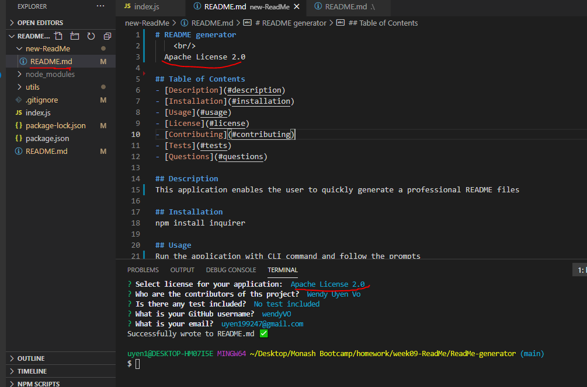

# README generator

  

## Table of Contents
- [Description](#description)
- [Installation](#installation)
- [Usage](#usage)
- [License](#license)
- [Contributing](#contributing)
- [Tests](#tests)
- [Questions](#questions)

## Description
This application enables the user to quickly generate a professional README files

## Installation
npm install inquirer

## Usage
Run the application with CLI command "node index.js" and follow the prompts
 

 
[Video Link](https://drive.google.com/file/d/1SPX4sF6MNswFpJ-uzXWlubbnY2lrHanT/view)

## License

 
This application is covered under  license. 

## Contributing
Contributors: Wendy Uyen Vo.  
Please read this [Setting guidelines for repository contributors](https://docs.github.com/en/github/building-a-strong-community/setting-guidelines-for-repository-contributors) for more informations.

## Tests
No test included

## Links to the GitHub Repositories:

-The URL of the GitHub repository: https://github.com/wendyVo/ReadMe-generator.git

## Questions

Please contact me should you have any questions:  
:email:   Email: uyen199247@gmail.com  
:octocat: GitHub:  [wendyVo](https://github.com/wendyVo)